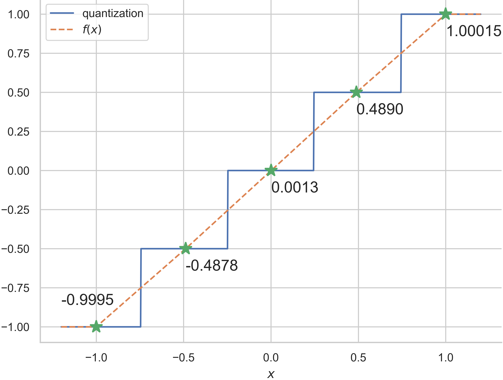

# MagicMaster

This work is based on the Magvit-v2 method. The main differences are:

- Incorporation of the FSQ quantizer.
- Utilization of a 2D discriminator.


## Install

**Step 0.**  Download and install Miniconda from [official website](https://docs.conda.io/en/latest/miniconda.html)

**Step 1.**  Create a conda environment and activate it

```bash
conda create --name magic python=3.9 -y
conda activate magic
```

**Step 2.** Install PyTorch following official instructions, e.g.

```bash
conda install pytorch==2.1.0 torchvision==0.16.0 torchaudio==2.1.0 pytorch-cuda=12.1 -c pytorch -c nvidia
```

**Step 3.** Install MMCV

```bash
pip3 install boto3 addict tqdm regex pyyaml opencv-python opencv-contrib-python future tensorboard filelock yapf attrs einops opencv-python-headless numpy scipy  mmcv==2.1.0 psutil mmengine timm
```

**Step 4.** Install MagicMaster

```bash
git clone https://github.com/ZhichengHuang/MagicMaster
cd MagicMaster
pip3 install -v -e .
```


## Preparation

**Step 0.** Download the K600 and ImageNet-1k dataset

**Step 1.** Download the Inception and i3d pretraining weight and save to 

````bash

sudo apt-get install git-lfs
git lfs install 
git lfs clone https://huggingface.co/David-huang/MagicMaster
# mv the init folder cp work_dirs/init
cp  -r MagicMaster/init ${code_root_foder}/work_dirs/
# weight folder contains the pretrain weight
cp  -r MagicMaster/weight ${code_root_foder}/work_dirs/
````

The project has the following structures:

```bash
MagicMaster
|--magicmaster
|--tools
|--requirements
|--configs
|--work_dirs
|    |--init
|    |   |--FID
|    |   |--FVD
|    |   |--lpips
|    |--weight
|    |   |--ImageNet
|    |   |--K600
|--data
|    |-ImageNet
|    |   |-ImageNet_train.json
|    |   |-ImageNet_val.json
|    |   |-train
|    |   |-val
|    |-k600
|    |   |-train_new.txt
|    |   |-val_new.txt
|    |   |-train
|    |   |-val
```


## Results

The reconstruction results on the K600 validation set.

| Model | Dict Size | Base Channel | Epoch | FVD   | Weight                                                       |
| ----- | --------- | ------------ | ----- | ----- | ------------------------------------------------------------ |
| FSQ   | 64000     | 64           | 40    | 59.65 | [Model](https://huggingface.co/David-huang/MagicMaster/resolve/main/weight/K600/magvit_v2_fsq_k600_style2_d64_64000_128x128_4x32_ep40-1ea3cc49.pth) |
| FSQ   | 15360     | 64           | 40    | 66.08 | [Model](https://huggingface.co/David-huang/MagicMaster/resolve/main/weight/K600/magvit_v2_fsq_k600_style2_d64_15360_128x128_4x32_ep40-1a57fc35.pth) |
| FSQ   | 64000     | 64           | 100   | 40.65 | [Model](https://huggingface.co/David-huang/MagicMaster/resolve/main/weight/K600/magvit_v2_fsq_k600_style2_d64_64000_128x128_4x32_ep100-5a8fe2fd.pth) |
| FSQ   | 64000     | 128          | 100   | 27.36 | [Model](https://huggingface.co/David-huang/MagicMaster/resolve/main/weight/K600/magvit_v2_fsq_k600_style2_d128_64000_128x128_4x32_ep100-e154b0bc.pth) |
| DSQ   | 64000     | 64           | 40    | 58.67 | [Model](https://huggingface.co/David-huang/MagicMaster/resolve/main/weight/K600/magvit_v2_fdq_k600_style2_d64_64000_128x128_4x32_ep40-40619d87.pth) |
| DSQ   | 15360     | 64           | 40    | 64.62 | [Model](https://huggingface.co/David-huang/MagicMaster/resolve/main/weight/K600/magvit_v2_fdq_k600_style2_d64_15360_128x128_4x32_ep40-7e7c5f83.pth) |

The reconstruction results on the ImageNet-1k validation set.

| Model    | Discriminator | Dict Size | Batch | Image Size | #Tokens | Epoch | FID      | Weight                                                       |
| -------- | ------------- | --------- | ----- | ---------- | ------- | ----- | -------- | ------------------------------------------------------------ |
| LlamaGen | Patch         | 16384     | 16*8  | 256*256    | 32*32   | 40    | 0.59     | -                                                            |
| FSQ      | Style         | 64000     | 32*8  | 128*128    | 16*16   | 200   | 1.67     | [Model](https://huggingface.co/David-huang/MagicMaster/resolve/main/weight/ImageNet/magvit_fsq_imagenet1k_style2_d128_64000_128x128_32x8_ep200-5eb9ab62.pth) |
| FSQ      | Style         | 64000     | 32*8  | 128*128    | 16*16   | 20    | 3.99     | [Model](https://huggingface.co/David-huang/MagicMaster/resolve/main/weight/ImageNet/magvit_fsq_imagenet1k_style2_d128_64000_128x128_32x8_ep20-15d28635.pth) |
| FSQ      | Patch         | 64000     | 32*8  | 128*128    | 16*16   | 20    | 6.46     | [Model](https://huggingface.co/David-huang/MagicMaster/resolve/main/weight/ImageNet/magvit_fsq_imagenet1k_patch_d128_64000_128x128_32x8_ep20-aacbd25f.pth) |
| FSQ      | Style         | 64000     | 8*8   | 256*256    | 32*32   | 20    | 0.72     | [Model](https://huggingface.co/David-huang/MagicMaster/resolve/main/weight/ImageNet/magvit_fsq_imagenet1k_style2_d128_64000_256x256_8x8_ep20-a5199ec3.pth) |
| FSQ      | Style         | 64000     | 8*8   | 256*256    | 32*32   | 50    | **0.48** | [Model](https://huggingface.co/David-huang/MagicMaster/resolve/main/weight/ImageNet/magvit_fsq_imagenet1k_style2_d128_64000_256x256_8x8_ep60-0e741e70.pth) |
| FSQ      | Style         | 15360     | 8*8   | 256*256    | 32*32   | 50    | 0.55     | [Model](https://huggingface.co/David-huang/MagicMaster/resolve/main/weight/ImageNet/magvit_fsq_imagenet1k_style2_d128_15360_256x256_8x8_ep60-0cb737ee.pth) |
| FSQ      | Style         | 64000     | 8*8   | 128*128    | 16*16   | 20    | 2.74     | [Model](https://huggingface.co/David-huang/MagicMaster/resolve/main/weight/ImageNet/magvit_fsq_imagenet1k_style2_d128_64000_128x128_8x8_ep20-04cd7358.pth) |


## Training

```bash
#Training on a single node with 8 GPUs.
bash tools/dist_train.sh configs/magvit/magvit_fsq_imagenet1k_style2_d128_64000_128x128_8x8_ep20.py 8

bash tools/dist_train.sh configs/magvit/magvit_v2_fsq_k600_style2_d64_15360_128x128_4x32_ep40.py 8
# Training with a video dataset requires 32 GPUs. For multi-node training, please refer to the documentation https://mmengine.readthedocs.io/en/latest/common_usage/distributed_training.html
```

## Testing

```bash
# Test the pretraining weights using 8 GPUs.
bash tools/dist_test.sh configs/magvit/magvit_fsq_imagenet1k_style2_d128_64000_128x128_8x8_ep20.py ./work_dirs/weight/ImageNet/magvit_fsq_imagenet1k_style2_d128_64000_128x128_8x8_ep20-04cd7358.pth 8
```

## Reconstruction Visualization

Visualization of the model trained at $256 \times 256$ resolution and tested at $256 \times 256$ resolution. The model can get an FID of 0.55.


## Dynamic Scalar Quantization

Compared to the LFQ method employed in Magvit-v2, which performs binary encoding on input features, the FSQ quantization function divides each channel into multiple bins before encoding the input features. The FSQ method offers several advantages over LFQ, including the elimination of the need for a commitment loss and a reduction in quantization error. In FSQ, the model maps the input scalar using the $tanh(x)$ function and then uniformly divides the output space to achieve feature quantization. However, a limitation of this method is that the quantization intervals are fixed. To provide more flexibility, this study introduces dynamically learnable quantization intervals. An example of this quantization is shown as follows:



The specific process is as follows:

Assume $x$ is the scalar of one channel to be quantized, $b_0$ is the left endpoint of the quantization interval, $\left[ l_0, l_1, l_2, \cdots  \right]$ represents the learnable lengths of each bin, and $n$ represents the interval in the output space. The forward propagation process of this quantization function is described by the following equation:

$$
\begin{equation}
y=
\begin{cases}
-1.0, & x<b_0+\frac{l_0}{2} \\
-1.0 +n, & x\geq b_0+\frac{l_0}{2} \\
-1.0 +2n, & x\geq b_0+l_0+\frac{l_1}{2} \\
\cdots
\end{cases}
\label{f-1-1}
\end{equation}
$$


$$
\begin{equation}
f(x)=\begin{cases}
-1.0，& x<s_0 \\
\frac{n}{l_0}\cdot (x-b_0)+(b_0+n)-n, & x \geq b_0 \\
\frac{n}{l_1} \cdot[x-(b_o+l_0)]+(b_0+2n)-n, & x \geq b_0+l_0 \\
\frac{n}{l_2} \cdot[x-(b_o+l_0+l_1)]+(b_0+3n)-n, & x \geq b_0+l_0 +l_1 \\
\cdots
\end{cases}
\label{f-1-2}
\end{equation}
$$


## Acknowledgement

We would like to thank the following repos for their great work:

- This work is built based on the [mmengine](https://github.com/open-mmlab/mmengine)
- Some code is borrowed from [mmagic](https://github.com/open-mmlab/mmagic)
- Some code is borrowed from [vector-quantize-pytorch](https://github.com/lucidrains/vector-quantize-pytorch)
